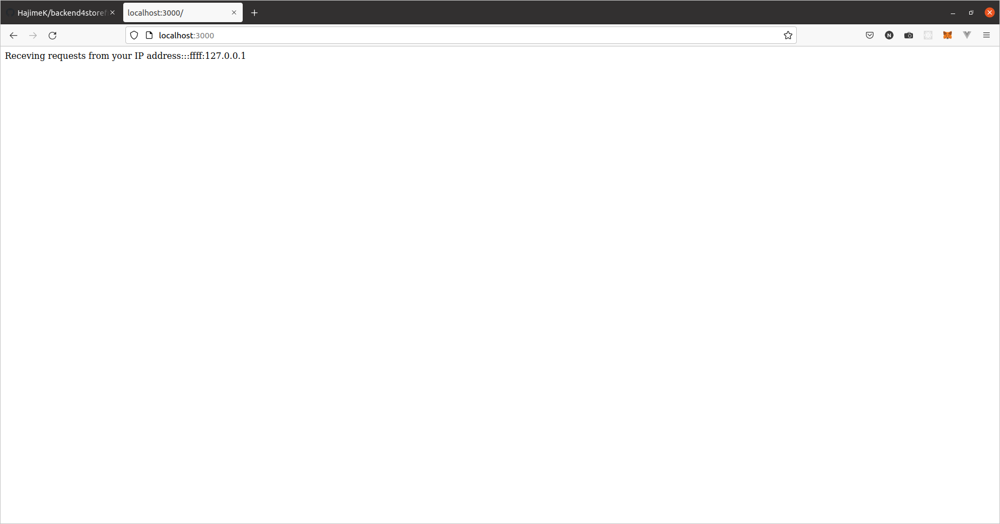

# README

**CAUTION**

All the environment file for the container is configured in *.env* including the password.
This appliacation in the repository is provided as experimental purpose,
and the passowrds are also included in the *.env* file.
When you develop application which provides the service opent to the internet,
do not forget to *.env* to add to *.gitignore* so that the user IDs and passords are not open in the *git* repository.

Also if you provide the service external to the internet, configure firewall to prevent access except your middleware.
Only provide the port application provides (Here port number 3000 is provided).

## About this project

This is the project to provide **node.js + express + typescript** which connects to backend DB.


- [README](#readme)
  - [About this project](#about-this-project)
  - [How to launch the application](#how-to-launch-the-application)
    - [pre-requisite](#pre-requisite)
    - [Repository](#repository)
    - [PostgresSQL server](#postgressql-server)
      - [Launch PostgreSQL Locally](#launch-postgresql-locally)
      - [Launch PostgreSQL server.](#launch-postgresql-server)
      - [Launch PostgreSQL with docker-compose](#launch-postgresql-with-docker-compose)
      - [clean up the environment](#clean-up-the-environment)
  - [Test the application](#test-the-application)
    - [Install the npm package dependencies.](#install-the-npm-package-dependencies)
    - [Launch the middleware](#launch-the-middleware)
    - [Launch](#launch)
      - [Database Server](#database-server)
    - [Run Jasmine unit tests with the middleware functions](#run-jasmine-unit-tests-with-the-middleware-functions)

## How to launch the application

### pre-requisite

To run the middleware, you need followings properly set up in your environment.
- git
- npm and node.js
- Docker and Docker-Composer


### Repository

In your git folder, run the following command
```
git clone https://github.com/HajimeK/backend4storefront_with_express_and_postgresql
cd ./backend4storefront_with_express_and_postgresql
```

### PostgresSQL server

#### Launch PostgreSQL Locally

#### Launch PostgreSQL server.

As the middleware needs in the backend PostgreSQL server,
run the followign command to launch the PostgreSQL server.


```sh
sudo apt update
sudo apt install postgresql
sudo apt install postgresql-contrib
sudo -i -u postgres
postgres@ubuntu:~$ psql
psql (12.8 (Ubuntu 12.8-0ubuntu0.20.04.1))
Type "help" for help.

postgres=# CREATE USER storefront WITH PASSWORD 'pass';
CREATE ROLE
postgres=# CREATE DATABASE backend4storefront_test;
CREATE DATABASE
postgres=# CREATE DATABASE backend4storefront;
CREATE DATABASE
postgres=# GRANT ALL PRIVILEGES ON DATABASE backend4storefront TO storefront;
GRANT
postgres=# GRANT ALL PRIVILEGES ON DATABASE backend4storefront_test TO storefront;
GRANT
```

#### Launch PostgreSQL with docker-compose

Run the followign command to launch the PostgreSQL server.
In this code example, db user is assumed "root".
Please update *user* in *backend/api/database.json* and *POSTGRES_USER* in the *.env* values to *root* accordingl.

```sh
docker-compose up -d
```

This will launch the PostgreSQL server and PostgreSQL Admin tools as docker containers each.


#### clean up the environment

After you run your test, run below to shutdown the docker components.

```sh
docker-compose down
```

```sh
docker rmi $(sudo docker images -q) -f
docker volume prune
```


## Test the application

### Install the npm package dependencies.

```
cd api/backend
npm install
```

### Launch the middleware

Not needed first time, but you can safely lauch the middleware by cleaning up the database with the following command.

```
npm run db-down
```


### Launch

Run the following command to create dependent database tables and the middleware. The middleware listens the port *3000* in your local host.

```
npm run dev
```

Try with *http://localhost:3000* for APIs implemented in this porject. If you access to the *http://localhost:3000* in your browser you will find the following as the health check response.



Type **Ctrl+c** to stop the launched middleware in your command line.

#### Database Server

**As stated in the top of this document, you should change the user and password in the *.env* file, and add the *.env* file to *.gitignore* to keep them secreate and secure.**


While you are running the applications, you may need to access to the database for maintenance.

You can connect to the DB in command line to connect to the database server (host: 0.0.0.0 (local), and port 5432) with the user *root* and the database backend4storefront_test.


``` sql
psql -h 0.0.0.0 -p 5432 -U root backend4storefront_test;
\q
```

You will be prompted a *root* user password. Please use *pass*, for testing puporse.

Or you can use the admin tools running as a docker container.

In the case you launched the PostgreSQL server without docker-compose instead,

```csh
psql -h 0.0.0.0 -p 5432 -U storefront backend4storefront_test
```

```
http://localhost:3001
```
Login with user the user email address which is sen in the *.env* file and password *pass*.

For both, to access database server, user *root* and password *pass* can be user.

### Run Jasmine unit tests with the middleware functions

Ren bdelow to test the feasures defined in the [REQUIREMENTS.md](./REQUIREMENTS.md).

```
npm run test
```

Then you should find the following output.
Here in the test following will be executed:
- Access to the API end points
- Call model layer to access data base and provision data to the end points
- Database to send back correct data queried by the model layer with CRUD features.

```

Jasmine started
starting app on: 0.0.0.0:3000

  Test Suite for database client
    ✓ connect to db
    ✓ release db connection

  Order Item Model
    ✓ create method should add an order item
    ✓ index method should return a list of order items for an order
    ✓ show method should return the correct order
    ✓ update method should update an order item quantity
    ✓ delete method should remove the order

  Order Model
    ✓ create method should add an order
    ✓ index method should return a list of order
    ✓ show method should return the correct order
    ✓ update method should update an order status
    ✓ update method should update an order item
    ✓ delete method should remove the order

  Order Status Model
    ✓ create method should add a Order Status
    ✓ index method should return a list of product categories
    ✓ show method should return the correct Order Status
    ✓ update method should update a Order Status
    ✓ delete method should remove the Order Status

  Product Category Model
    ✓ create method should add a Product Category
    ✓ index method should return a list of product categories
    ✓ show method should return the correct product category
    ✓ update method should update a product category
    ✓ delete method should remove the product category

  Product Model
    ✓ create method should add a product
    ✓ create method should add a product (2nd)
    ✓ index method should return a list of products
    ✓ index method should return a list of product with category
    ✓ show method should return the correct product
    ✓ update method should update a product fields
    ✓ delete method should remove the product

  User Model
    ✓ create method should add a user
    ✓ index method should return a list of users
    ✓ show method should return the correct user
    ✓ authenticate with correst user/pass to approve login
    ✓ authenticate with wrong pass to approve login
    ✓ authenticate with wrong user to approve login
    ✓ update method should update a product fields
    ✓ delete method should remove the user

  Test suite for /order
    ✓ /order/create create method should add an order
    ✓ /order/index/userid index method should return a list of order for user
    ✓ /order/index/1?status=2 index method should return a list of order for user with completed
    ✓ /order/show/0 show method should return the correct order
    ✓ /order/delete delete method should remove the order

  Test Suite for /product
    ✓ /product/create create method should add a product (first)
    ✓ /product/create create method should add a product (2nd)
    ✓ /product/index
    ✓ /product/index?category=1
    ✓ /product/show/2
    ✓ /product/delete

  Test suite for /user
    ✓ /user/login
    ✓ /user/create
    ✓ /user/index
    ✓ /user/show/1

  Test Suite for /
    ✓ Server healthcheck

Executed 54 of 54 specs SUCCESS in 2 secs.
```